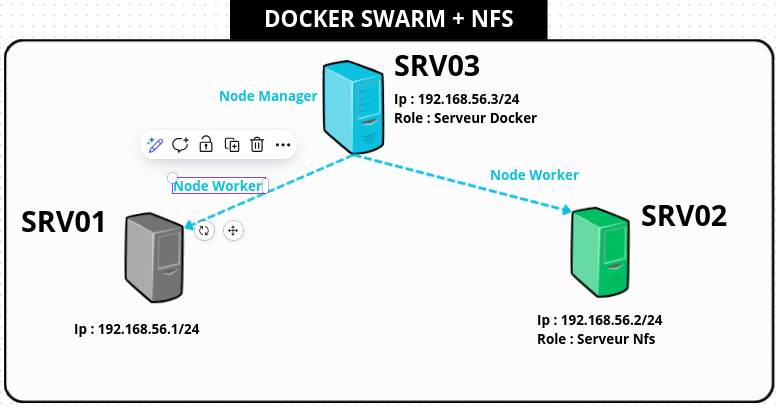
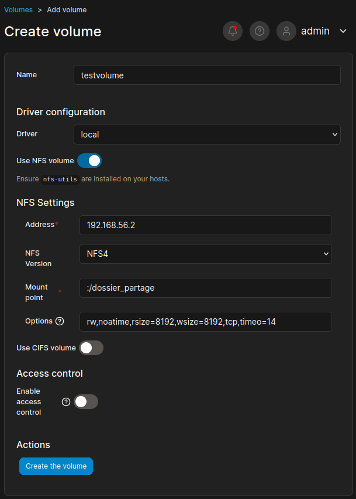

# Guide d'installation et de configuration de SWARM + NFS avec mistserver



## Table des matières
- [Configuration du serveur NFS](#configuration-du-serveur-nfs)
- [Configuration des clients NFS](#configuration-des-clients-nfs)
- [Configuration du volume Docker](#configuration-du-volume-docker)
- [Déploiement de la stack mistserver](#déploiement-de-la-stack-mistserver)
- [Gestion des conteneurs](#gestion-des-conteneurs)
- [Conseils et bonnes pratiques](#conseils-et-bonnes-pratiques)

## Prérequis

### Ajout de l'utilisateur au groupe Docker
```bash
sudo usermod -aG docker $USER
```
> **Note :** Redémarrez votre session après cette commande pour que les changements prennent effet.

## Configuration du serveur NFS

### 1. Installation du package nfs-server
```bash
# Sur le serveur NFS
sudo apt update
sudo apt install nfs-kernel-server
```

### 2. Création du dossier de partage
```bash
# Sur le serveur NFS
sudo mkdir -p /dossier_partage/admin
sudo chmod 777 /dossier_partage
sudo cp votre_fichier_config.json /dossier_partage/admin/
```

### 3. Configuration des exports NFS
```bash
# Sur le serveur NFS
sudo nano /etc/exports
```

Ajoutez la ligne suivante dans le fichier `/etc/exports` :
```
/dossier_partage 192.168.56.0/24(rw,sync,no_subtree_check,no_root_squash)
```

### 4. Application de la configuration
```bash
# Mise à jour de la configuration NFS
sudo exportfs -ra
sudo systemctl restart nfs-kernel-server
```

## Configuration des clients NFS

### 1. Installation du package client NFS
```bash
# Sur les autres serveurs (clients)
sudo apt update
sudo apt install nfs-common
```

### 2. Montage du volume NFS
```bash
# Création du point de montage (même chemin que sur le serveur NFS)
sudo mkdir -p /dossier_partage

# Montage du volume NFS
sudo mount 192.168.56.2:/dossier_partage /dossier_partage
```

### 3. Vérification du montage
```bash
# Vérifier que le volume est correctement monté
df -h | grep 192

# Tester l'accès au contenu dans un conteneur
sudo docker run --rm -it -v /dossier_partage:/data ubuntu bash
```

## Configuration du volume Docker

### Création du volume Docker basé sur le partage NFS


```bash
# Créer un volume Docker externe qui utilise le dossier NFS
docker volume create --driver local \
  --opt type=none \
  --opt o=bind \
  --opt device=/dossier_partage \
  testvolume
```

> **Important :** Le volume doit être nommé `testvolume` pour correspondre à la configuration de la stack mistserver.

## Déploiement de la stack mistserver

### 1. Création du fichier de configuration
```bash
# Créer le fichier de configuration de la stack
sudo touch configuration.yml
sudo nano configuration.yml
```

Copiez le contenu suivant dans le fichier `configuration.yml` :

```yaml
version: '3.8'

services:
  mistserver:
    image: ddvtech/mistserver_alpine_minimal
    command: MistController -c /data/admin/config.json
    ports:
      - 8080:8080
      - 4242:4242
      - 1935:1935
    volumes:
      - testvolume:/data
    deploy:
      replicas: 3
      resources:
        limits:
          memory: 2g
        reservations:
          memory: 1g
      placement:
        constraints:
          - node.role == worker
    shm_size: 1g

volumes:
  testvolume:
    external: true
```

> **Note :** Ce fichier configure :
> - **3 réplicas** du service mistserver pour la haute disponibilité
> - **Limites de mémoire** : 2 Go maximum, 1 Go réservé par conteneur
> - **Ports exposés** : 8080 (interface web), 4242 (API), 1935 (RTMP)
> - **Volume externe** : `testvolume` qui doit être créé au préalable

### 2. Déploiement de la stack
```bash
# Déployer la stack avec la configuration
sudo docker stack deploy -c configuration.yml mistserver_stack
```

### 3. Vérification du déploiement
```bash
# Vérifier que la stack est bien déployée
sudo docker stack ls | grep mistserver_stack

# Afficher les services de la stack
sudo docker stack services mistserver_stack
```

## Gestion des conteneurs

### Commandes utiles pour la gestion de la stack
```bash
# Lister toutes les stacks
sudo docker stack ls

# Voir les services d'une stack
sudo docker stack services mistserver_stack

# Voir les logs d'un service
sudo docker service logs mistserver_stack_nom_du_service

# Supprimer une stack
sudo docker stack rm mistserver_stack
```

## Conseils et bonnes pratiques

1. **Initialisation de Docker Swarm** : Assurez-vous que Docker Swarm est bien initialisé et que le serveur est configuré comme manager :
   ```bash
   sudo docker swarm init
   ```

2. **Montage permanent** : Pour un montage automatique au démarrage, ajoutez la ligne suivante dans `/etc/fstab` :
   ```
   192.168.56.2:/dossier_partage /dossier_partage nfs defaults 0 0
   ```

3. **Mise à jour de la stack** : Pour mettre à jour la configuration, vous pouvez :
   - Modifier le fichier `configuration.yml`
   - Redéployer la stack avec la même commande `docker stack deploy`
   - Ou supprimer la stack et la redéployer :
     ```bash
     sudo docker stack rm mistserver_stack
     # Attendre que la stack soit complètement supprimée
     sudo docker stack deploy -c configuration.yml mistserver_stack
     ```

4. **Sécurité** : Configurez les permissions appropriées sur les dossiers partagés et limitez l'accès réseau selon vos besoins.

5. **Sauvegarde** : Pensez à sauvegarder régulièrement vos configurations et données importantes.

## Dépannage

### Problèmes courants
- **Volume non monté** : Vérifiez que le service NFS est démarré sur le serveur
- **Permissions refusées** : Vérifiez les permissions des dossiers et la configuration des exports
- **Connectivité réseau** : Assurez-vous que les ports NFS (2049) sont ouverts entre les serveurs